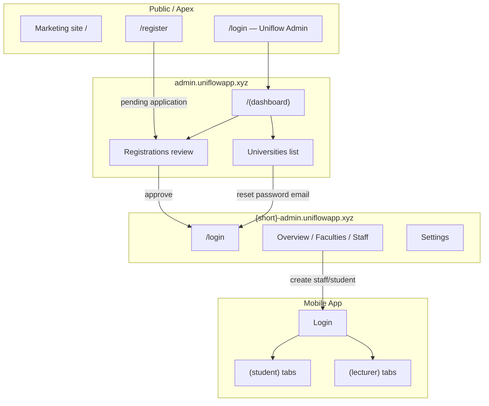
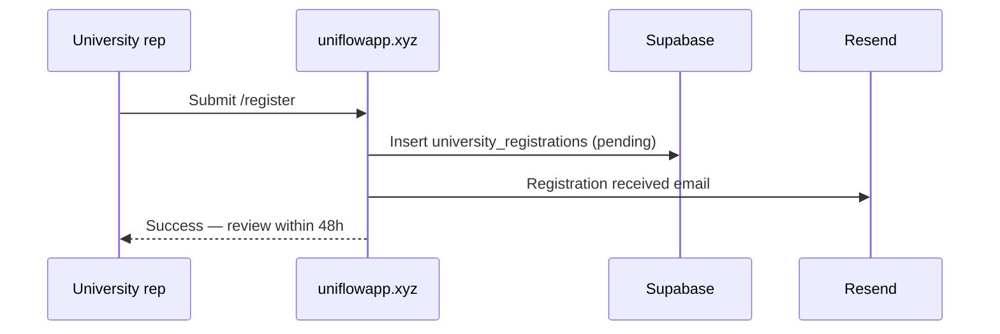
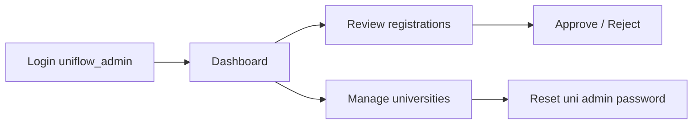
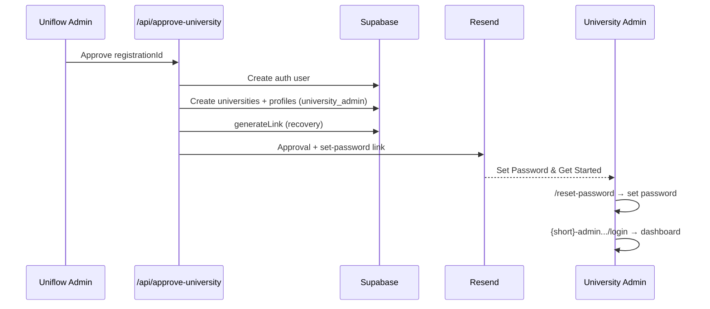
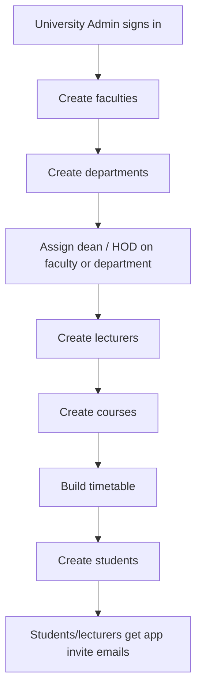
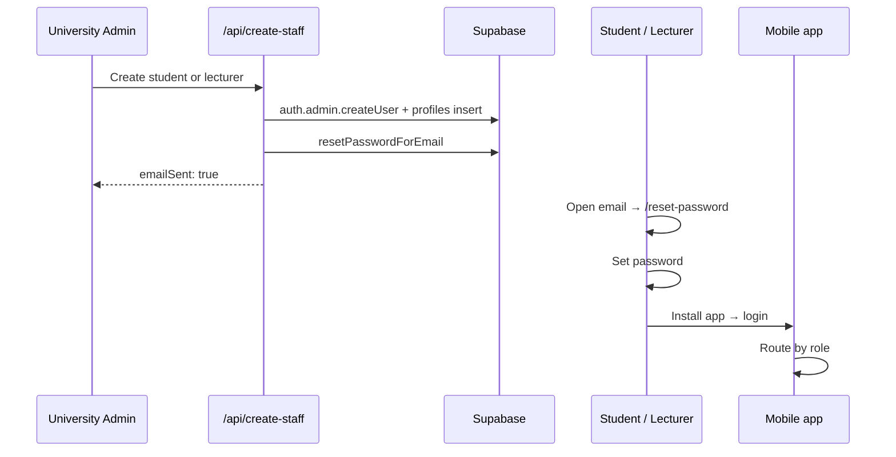
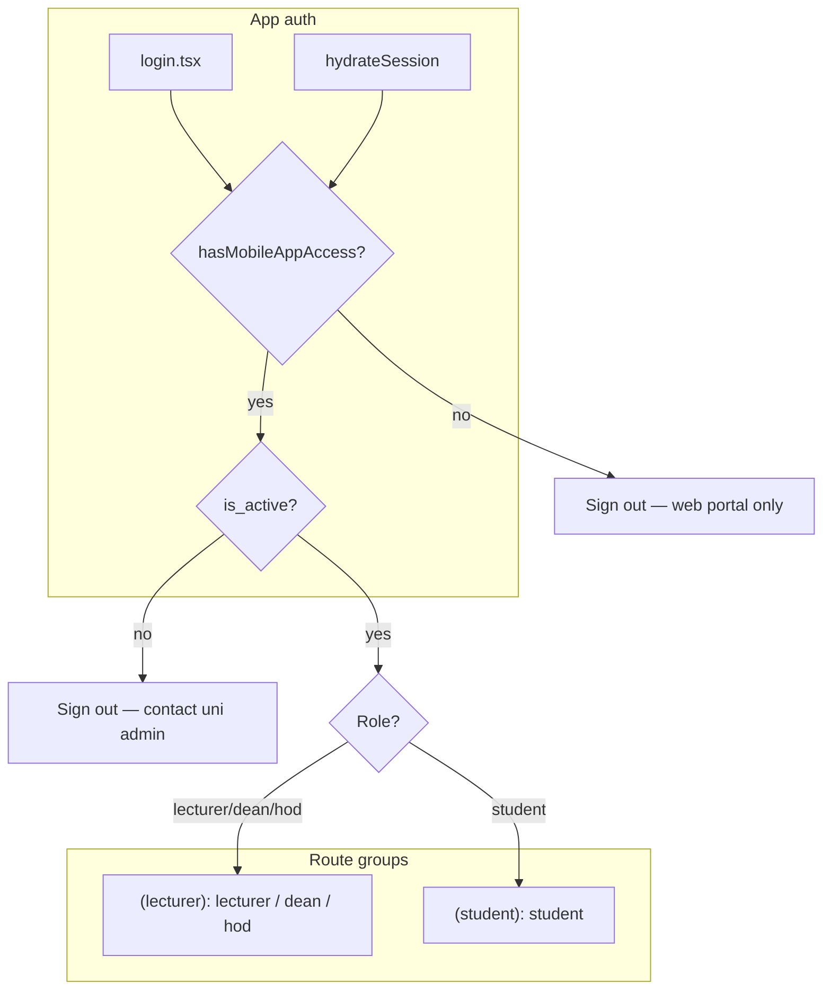

# Uniflow Platform Workflow

End-to-end guide to how **Uniflow Admin**, **University Admin**, and the **mobile app** connect — from a university registering on the marketing site to a student or lecturer using the app on campus.

---

## Table of contents

1. [Platform overview](#1-platform-overview)
2. [Domains, hosts, and routing](#2-domains-hosts-and-routing)
3. [Roles and access matrix](#3-roles-and-access-matrix)
4. [Phase 1 — Public registration](#4-phase-1--public-registration)
5. [Phase 2 — Uniflow Admin (super admin)](#5-phase-2--uniflow-admin-super-admin)
6. [Phase 3 — University onboarding](#6-phase-3--university-onboarding)
7. [Phase 4 — University Admin portal](#7-phase-4--university-admin-portal)
8. [Phase 5 — Creating staff and students](#8-phase-5--creating-staff-and-students)
9. [Phase 6 — Mobile app](#9-phase-6--mobile-app)
10. [Password and security policies](#10-password-and-security-policies)
11. [Notifications and real-time](#11-notifications-and-real-time)
12. [Quick reference](#12-quick-reference)

---

## 1. Platform overview

Uniflow is a monorepo with two applications sharing one Supabase backend:

| App | Stack | Who uses it |
|-----|-------|-------------|
| `uniflow-web` | Next.js 16 | Uniflow operators, university administrators |
| `uniflow-app` | Expo / React Native | Students, lecturers, deans, HODs |



**High-level journey**

1. A university **registers** on the public site.
2. A **Uniflow Admin** reviews and **approves** the application.
3. The university gets a **dedicated admin portal** (`{shortname}-admin.uniflowapp.xyz`).
4. The **University Admin** sets up faculties, departments, courses, timetables, and creates **staff/student accounts**.
5. Staff and students receive a **set-password email**, install the app, and sign in.
6. The app routes them into **student** or **lecturer** experiences based on role (dean and HOD use the lecturer experience).

---

## 2. Domains, hosts, and routing

### Production hosts

| Host | Purpose |
|------|---------|
| `uniflowapp.xyz` | Marketing, public registration, Uniflow Admin login, password reset landing |
| `admin.uniflowapp.xyz` | Uniflow Admin dashboard (role-gated) |
| `{shortname}-admin.uniflowapp.xyz` | Per-university admin portal (e.g. `abu-admin.uniflowapp.xyz`) |

### Local development

| Host | Maps to |
|------|---------|
| `localhost:3000` | Apex (same as production apex) |
| `admin.localhost:3000` | Super admin subdomain |
| `{shortname}-admin.localhost:3000` | University portal |

Auth cookies are shared across `*.localhost` in dev via `domain: ".localhost"`.

### How university URLs work internally

Users on a university subdomain see **clean paths** without `/u`:

```
abu-admin.uniflowapp.xyz/faculties   →  internally /u/faculties
abu-admin.uniflowapp.xyz/login       →  internally /u/login
```

The Next.js **proxy** (`uniflow-web/src/proxy.ts`) handles:

- Rewriting external paths to internal `/u/*` routes
- Redirecting `/u/*` back to canonical external URLs
- Auth guards per host (super admin vs university portal vs apex)
- Blocking self-service `/forgot-password` (redirects to `/login`)

---

## 3. Roles and access matrix

| Role | Uniflow Admin web | University Admin web | Mobile app | Created by |
|------|-------------------|----------------------|------------|------------|
| `uniflow_admin` | ✅ | ❌ | ❌ | Manual / seed |
| `university_admin` | ❌ | ✅ | ❌ | University approval flow |
| `lecturer` | ❌ | ❌ | ✅ → `(lecturer)` group | University Admin |
| `dean` | ❌ | ❌ | ✅ → `(lecturer)` group | University Admin |
| `hod` | ❌ | ❌ | ✅ → `(lecturer)` group | University Admin |
| `student` | ❌ | ❌ | ✅ → `(student)` group | University Admin |

**Key rules**

- **Web admins** (`uniflow_admin`, `university_admin`) are blocked from the mobile app at sign-in.
- **Mobile users** (`student`, `lecturer`, `dean`, `hod`) use the app only — no web admin portal access.
- **Dean** and **HOD** are staff roles with extra metadata (faculty/department leadership); they share the **lecturer** app UI, not a separate shell.
- Inactive accounts (`is_active: false`) cannot sign into the app.

---

## 4. Phase 1 — Public registration

**Where:** `https://uniflowapp.xyz/register`

**What happens**

1. A university representative fills the registration form.
2. A row is inserted into `university_registrations` with `status: 'pending'`.
3. A confirmation email is sent via `/api/send-registration-email`.

**Typical fields**

- University name and short name (lowercase, used for subdomain)
- Official email, phone, country, state
- Contact person name and role
- Estimated student count, website

**Outcome:** The application waits in the queue for Uniflow Admin review. No portal or accounts exist yet.



---

## 5. Phase 2 — Uniflow Admin (super admin)

### Signing in

**Login URLs**

- `https://uniflowapp.xyz/login`
- `https://admin.uniflowapp.xyz` (redirects unauthenticated users to `/login`)

**Login steps**

1. Email + password via Supabase `signInWithPassword`.
2. Portal verification: `POST /api/auth/verify-portal` with `portal: "uniflow_admin"`.
3. If the profile role is not `uniflow_admin` → sign out, show access denied.
4. Redirect to `/(dashboard)`.

> OTP verification exists in code but is **currently disabled** on both admin login flows.

### Dashboard areas

| Route | Purpose |
|-------|---------|
| `/(dashboard)` | Overview — registration stats, recent applications |
| `/(dashboard)/registrations` | Approve or reject pending university applications |
| `/(dashboard)/universities` | List approved universities; send password reset to uni admins |
| `/(dashboard)/notifications` | Platform notifications |
| `/(dashboard)/settings` | Edit profile; change password (requires current password) |

### What Uniflow Admin does NOT do

- Manage individual students or lecturers (that is University Admin work).
- Use the mobile app (role is web-only).
- Use self-service “Forgot password?” (must contact another Uniflow administrator).



---

## 6. Phase 3 — University onboarding

When a Uniflow Admin **approves** a registration (`POST /api/approve-university`):

### Backend steps

1. Normalize the official email address.
2. Create a Supabase auth user (email confirmed, bootstrap password server-side only).
3. Insert a `universities` row (`status: 'approved'`, `is_active: true`).
4. Insert a `profiles` row with `role: 'university_admin'` linked to that university.
5. Mark the registration `status: 'approved'`.
6. Generate a **recovery (set-password) link** targeting:
   ```
   https://uniflowapp.xyz/reset-password?university={shortname}
   ```
7. Send the **approval email** with:
   - Portal URL: `{shortname}-admin.uniflowapp.xyz`
   - Login email
   - “Set Password & Get Started” button

### University Admin first login

1. Open the set-password link from the approval email.
2. Tap **Continue to reset password** (establishes a recovery session).
3. Choose a new password.
4. Go to `{shortname}-admin.uniflowapp.xyz/login`.
5. Sign in with official email + new password.

The reset page detects the `?university=` parameter, shows the university name, and can redirect to the university subdomain when possible.



### Rejection path

`POST /api/reject-university` marks the registration rejected, stores a reason, and sends a rejection email with a link to reapply at `/register`.

---

## 7. Phase 4 — University Admin portal

### Signing in

**URL:** `https://{shortname}-admin.uniflowapp.xyz/login`

**Login steps**

1. Page detects university from subdomain and shows university name.
2. `signInWithPassword`.
3. `verifyPortalAccess(token, "university_admin")`.
4. Proxy verifies `profile.universities.short_name` matches the subdomain (wrong portal → `/unauthorized?reason=wrong-portal`).
5. Redirect to overview (`/` on subdomain, `/u` internally).

**Password help on login:** “Contact your Uniflow administrator” — no self-service forgot password.

### Portal structure

**Sidebar navigation**

| Item | Path (external) | Purpose |
|------|-----------------|---------|
| Overview | `/` | Stats, quick actions, recent activity |
| Faculties | `/faculties` | Manage faculties |
| Notifications | `/notifications` | Portal notifications |
| Settings | `/settings` | Profile + password change |

**Additional pages** (reachable from overview / faculties / departments)

| Page | Purpose |
|------|---------|
| Departments | CRUD departments within a faculty |
| Lecturers | Create/manage lecturers, deans, HODs; CSV import; reset passwords |
| Students | Create/manage students (levels 100–500); CSV import; reset passwords |
| Courses | Course catalog per department/level |
| Timetable | Schedule slots |

### Typical setup order



### University Admin capabilities

- Full CRUD on organizational structure (faculties → departments → courses).
- Create staff with roles: `lecturer`, `dean`, `hod`.
- Create students with academic level (100–500).
- Deactivate or delete staff/students.
- **Reset passwords** for staff/students via `/api/reset-password` (sends email).
- Change own password in Settings (current + new + confirm).
- Cannot self-request password reset via forgot-password flow.

---

## 8. Phase 5 — Creating staff and students

**API:** `POST /api/create-staff`  
**Auth:** Caller must `canManageUniversity(university_id)` (University Admin for their uni, or Uniflow Admin).

### Staff / student creation flow

1. University Admin submits name, email, role, department (and level for students).
2. Server creates Supabase auth user with a bootstrap password (never returned to UI).
3. Server inserts `profiles` row with role, `university_id`, `department_id`, and `level` (students).
4. Server sends `resetPasswordForEmail` → link to `https://uniflowapp.xyz/reset-password`.
5. UI shows success: “Reset email sent to {email}”.

### Role-specific notes

| Role | Level required | App routing |
|------|----------------|-------------|
| `student` | Yes (100–500) | `(student)` tab group |
| `lecturer` | No | `(lecturer)` tab group |
| `dean` | No | `(lecturer)` tab group; faculty linked via `faculties.dean_id` |
| `hod` | No | `(lecturer)` tab group; department linked via `departments.hod_id` |

### First-time user path to the app



---

## 9. Phase 6 — Mobile app

### Who can use the app

- ✅ `student`, `lecturer`, `dean`, `hod`
- ❌ `uniflow_admin`, `university_admin`

Blocked users see: *“This app is for lecturers, students, deans, and HODs only. Admin accounts must use the web portal.”*

### Authentication flow

**Sign in (`store/useAuthStore.ts`)**

1. `signInWithPassword` (email trimmed/lowercased).
2. Load `profiles` with university, department, and faculty joins.
3. `enrichProfile()` — for deans/HODs, resolves faculty/department from leadership tables if not on profile directly.
4. Check `hasMobileAppAccess(role)` → else sign out.
5. Check `is_active` → else sign out with deactivation message.
6. Store user + enriched profile in Zustand.

**Session on launch**

`hydrateSession()` re-validates role and active status; signs out if either check fails.

### Routing (`app/_layout.tsx` AuthGuard)

| Condition | Destination |
|-----------|-------------|
| Not authenticated | `/login` |
| Role is `lecturer`, `dean`, or `hod` | `/(lecturer)/*` |
| Role is `student` | `/(student)/*` |

There is **no separate dean/HOD app shell** — leadership roles use the lecturer navigation and screens. Role label in the UI may show “Dean” or “HOD” via `getMobileRoleLabel()`.

### App structure

Both `(student)` and `(lecturer)` groups share the same tab layout:

| Tab | Screen | Purpose |
|-----|--------|---------|
| Home | `index.tsx` | Dashboard / overview for the role |
| Timetable | `timetable.tsx` | Weekly schedule |
| Courses | `courses.tsx` | Enrolled or assigned courses |
| Resources | `resources.tsx` | Learning resources |
| Profile | `profile.tsx` | Account info, change password (hidden from tab bar) |
| Notifications | `notifications.tsx` | Real-time notifications (hidden from tab bar) |

### Forgot password (mobile only self-service reset)

1. User taps “Forgot password?” on app login.
2. App calls `{WEB_APP_URL}/api/public/request-password-reset` with `portal: "mobile"`.
3. API only sends email if role is a mobile role.
4. User opens link in browser → web `/reset-password` → sets password.
5. User returns to app and signs in.

### Dean and HOD in practice

| Role | Data enrichment | App experience |
|------|-----------------|----------------|
| `lecturer` | Department/faculty from profile | Lecturer tabs |
| `dean` | Faculty resolved from `faculties.dean_id` | Lecturer tabs, label “Dean” |
| `hod` | Department resolved from `departments.hod_id` | Lecturer tabs, label “HOD” |
| `student` | Level, department, enrollments | Student tabs |



---

## 10. Password and security policies

### Self-service forgot password

| Portal | Allowed? |
|--------|----------|
| Mobile app | ✅ Mobile roles only |
| Uniflow Admin login | ❌ Contact another Uniflow administrator |
| University Admin login | ❌ Contact Uniflow administrator |

### Admin-initiated reset (email link)

| Initiator | Target | Reset URL pattern |
|-----------|--------|-------------------|
| Uniflow Admin | University admin | `/reset-password?university={shortname}` |
| Uniflow Admin | Any user via API | Role-based URL from `passwordResetUrlForProfile` |
| University Admin | Staff / students | `{APP_URL}/reset-password` |

### In-session password change (Settings)

Available on all admin settings pages and in the mobile app profile:

1. Enter **current password** (re-authenticate via `signInWithPassword`).
2. Enter new + confirm password (min 6 characters).
3. `updateUser({ password })`.

### Recovery (email link) password set

Used for first-time setup and admin-initiated resets:

1. User opens email link with `token_hash` / `code` / `type=recovery`.
2. Client establishes a **recovery session** (tap “Continue to reset password” when prompted).
3. User sets new password — **no current password field**.
4. Session is cleared; user signs in fresh.

> If “Current password required” appears on the reset page, the recovery link was not verified. Open the email link again and complete the “Continue” step before setting a new password.

---

## 11. Notifications and real-time

- **Web portals** have notifications pages subscribed to Supabase realtime channels.
- **Mobile app** registers push notifications via `usePushNotifications` and has per-role notification screens.
- University Admin can surface activity through the portal overview and notifications.

---

## 12. Quick reference

### URLs cheat sheet

| Actor | Login | After login |
|-------|-------|-------------|
| Public | `uniflowapp.xyz/register` | — |
| Uniflow Admin | `uniflowapp.xyz/login` or `admin.uniflowapp.xyz` | `/(dashboard)` |
| University Admin | `{short}-admin.uniflowapp.xyz/login` | `/` (overview) |
| Mobile user | App login screen | `(student)` or `(lecturer)` tabs |

### Key API routes

| Endpoint | Who calls it | Purpose |
|----------|--------------|---------|
| `POST /api/approve-university` | Uniflow Admin | Create uni + university_admin + approval email |
| `POST /api/reject-university` | Uniflow Admin | Reject application |
| `POST /api/create-staff` | University Admin | Create lecturer/dean/hod/student + reset email |
| `POST /api/reset-password` | Uniflow or University Admin | Send reset email to any profile |
| `POST /api/public/request-password-reset` | Mobile app | Self-service reset for mobile roles |
| `POST /api/auth/verify-portal` | Web login pages | Enforce portal/role match |

### Data relationships (simplified)

```
universities
  └── faculties
        └── departments
              ├── courses
              ├── timetable_slots
              ├── students (profiles.role = student)
              └── lecturers (profiles.role = lecturer | dean | hod)

university_registrations  →  (approve)  →  universities + university_admin profile
```

---

## Summary

| Stage | Actor | Platform | Outcome |
|-------|-------|----------|---------|
| Register | University rep | `uniflowapp.xyz` | Pending application |
| Approve | Uniflow Admin | Dashboard | Live portal + university_admin account |
| Configure | University Admin | `{short}-admin.uniflowapp.xyz` | Faculties, staff, students, timetables |
| Onboard users | University Admin | Web API | Staff/students receive set-password emails |
| Daily use | Student / Lecturer / Dean / HOD | Mobile app | Timetable, courses, resources, notifications |

Uniflow Admin **governs the platform and onboards universities**. University Admin **runs the institution**. The mobile app **serves the academic community** — with dean and HOD included in the lecturer experience, and platform admins deliberately kept off mobile for security.