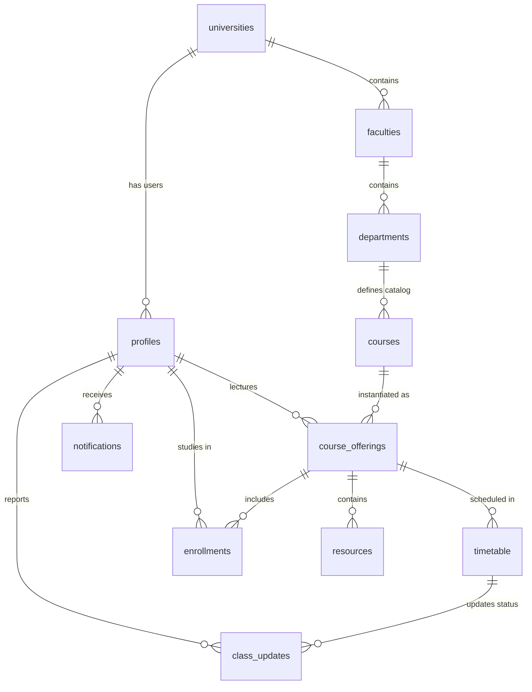

# Uniflow: Deep-Dive Feature & Domain Specification

This document provides a comprehensive analysis of the **Uniflow** platform. It compiles features, architecture, workflows, domain models, database designs, and system coordination logic into a single, in-depth reference for developers and system architects.

---

## 1. Executive Summary & Purpose

**Uniflow** is a unified academic coordination platform that bridges the communication and organization gaps between university administrators, academic staff, and students. In higher education institutions, communication is often fragmented (scattered across static PDFs, email, WhatsApp, or notices on boards), leading to zero real-time visibility into active class statuses, lecturer availability, relocations, or class cancellations.

Uniflow resolves these coordination problems through a dual-interface model:
1. **Administrative Web Portal (`uniflow-web`)**: A multi-tenant Next.js application managing university directories, catalogs, and schedules. It handles onboarding via a centralized Super Admin dashboard and custom subdomains for individual institutions.
2. **Mobile Application (`uniflow-app`)**: An Expo (React Native) app for students, lecturers, deans, and heads of departments (HODs) that displays real-time class timetables, facilitates course resource sharing, and houses peer-verified or lecturer-announced class updates.

### Core Problems Solved
* **Dynamic Schedules**: Replaces static timetable sheets/PDFs with live, session-aware calendars capable of handling sudden room relocations, cancellations, and slot reschedules.
* **Real-Time Coordination & Visibility**: Enables lecturers to publish immediate class delays or cancellations, and students to crowdsource class reports (e.g., "Lecturer absent") backed by community verification upvoting.
* **Centralized Academic Resources**: Provides a file repository scoped by course offering, allowing lecturers to upload materials directly and students to access them seamlessly.
* **Academic Session Isolation**: Automatically scopes all timetables, courses, and student enrollments to a specific academic session (e.g., `2025/2026`) and semester (e.g., `1` or `2`).

---

## 2. Multi-Tenant Domain & Routing Architecture

Uniflow uses a domain-rewriting proxy system to isolate tenants and administrative panels under clean, production-ready URLs.

### Production Domains
* **Marketing & Registration (`uniflowapp.xyz`)**: Public-facing landing page, onboarding registration form (`/register`), and password recovery handler (`/reset-password`).
* **Uniflow Super Admin (`admin.uniflowapp.xyz`)**: Central dashboard where platform operator profiles (role: `uniflow_admin`) review, approve, or reject pending university sign-ups.
* **University Portal (`{shortname}-admin.uniflowapp.xyz`)**: Custom administration site for approved universities (e.g., `abu-admin.uniflowapp.xyz`). 

### Local Development Hosts
* **Apex / Main**: `localhost:3000`
* **Super Admin Subdomain**: `admin.localhost:3000`
* **University Subdomain**: `{shortname}-admin.localhost:3000`

### Proxy Middleware Routing
A dedicated proxy engine (`uniflow-web/src/proxy.ts`) intercepts requests to perform subdomain rewrites and route guards:
* External paths like `abu-admin.uniflowapp.xyz/faculties` rewrite internally to `uniflow-web/src/app/(university)/u/faculties`.
* Next.js middleware verifies cookies across subdomains (`domain: ".uniflowapp.xyz"` in production or `.localhost` in dev) and prevents university administrators from crossing tenant boundaries.
* Self-service password resets are restricted to mobile roles; web administrators are redirected to `/login`.

---

## 3. User Roles & Permissions Matrix

Uniflow defines strict authorization boundaries across both web and mobile platforms.

| Role | Interface | Mobile Scope | Access Description |
|---|---|---|---|
| `uniflow_admin` | Web Dashboard | ❌ Blocked | Platform operator. Approves/rejects universities, manages onboarding, and resets tenant admin credentials. |
| `university_admin` | Web Subdomain | ❌ Blocked | Institutional admin. Configures faculties, departments, staff/student rosters, course catalogs, and timetables. |
| `lecturer` | Mobile App | `(lecturer)` tabs | Academic staff. Views assigned schedule, posts class delay/cancellation updates, and uploads course resources. |
| `dean` | Mobile App | `(lecturer)` tabs | Faculty head. Shares the lecturer experience but carries extra meta association linking them to a specific faculty. |
| `hod` | Mobile App | `(lecturer)` tabs | Head of Department. Shares the lecturer experience but links directly to department-wide schedules. |
| `student` | Mobile App | `(student)` tabs | Learner. Views custom class timetables, downloads resources, posts crowdsourced class reports, and upvotes status updates. |

---

## 4. End-to-End Platform Features

### 4.1 Onboarding & Super Admin
* **Public Registration**: Prospective university representatives apply online. A record is created in `university_registrations` with `pending` status.
* **University Approval System (`/api/approve-university`)**:
  * Normalizes the university's official email address.
  * Dynamically creates a Supabase Auth user for the tenant administrator.
  * Creates records in `universities`, `profiles`, and `university_admins` mapping the admin user to the university.
  * Generates an Auth Recovery link redirecting to `/reset-password?university={shortname}`.
  * Sends an onboarding invitation via Resend with subdomain link and password setup instructions.
* **Rejection Path (`/api/reject-university`)**: Rejects the application, logs reasons, and sends an email inviting the user to reapply.

### 4.2 University Admin Portal
* **Academic Directory CRUD**: Full setup of Faculties and Departments. Supports assigning lecturer profiles as Deans (faculty level) or HODs (department level).
* **Roster Management**:
  * Create, update, or toggle the status of lecturers and students.
  * **CSV Staff Import**: Bulk upload lecturers from CSV data.
  * **CSV Student Import**: Bulk upload students (`full_name, email, level, department_short_name`).
  * **Password Reset Triggers**: Sends reset email invitations directly from the admin panel to users.
* **Courses & Timetable Hub (The Course Offerings Redesign)**:
  * **Manual Scheduler**: Schedule individual slots linking courses, days, times, and classrooms.
  * **Combined CSV Timetable Import (`/api/timetable/import`)**: Uploads a unified CSV mapping courses, levels, semesters, credits, lecturers, days, times, and venues. Automatically provisions course catalogs, configures assignments, and schedules active slots.
  * **Auto-Enrollments Engine (`/api/enrollments/auto`)**: Automatically enrolls active students in course offerings for the current semester if their department and level match the course catalog.

### 4.3 Mobile Application (Expo & React Native)
* **Auth Guard & Session Hydration**: A Zustand-managed authentication engine validates profiles on startup, matches roles, and redirects users to either `(student)` or `(lecturer)` routing scopes. Web administrators are blocked from accessing the mobile app.
* **Forgot Password**: Request password reset link targeting `https://uniflowapp.xyz/reset-password` (endpoint restricted to mobile roles).
* **Dynamic Dashboards**:
  * **Today's Classes**: Displays timetable slots scheduled for the current day, calculated in real-time.
  * **Upcoming Schedule**: Shows upcoming classes for the remainder of the week.
  * **Analytics & Stats**: Shows course enrollment counters for lecturers, and enrolled course tallies for students.
* **Class Updates & Crowdsourcing**:
  * **Lecturer Updates**: Staff can post immediate alerts for delays (with specific `delay_minutes` parameters), venue relocations, or cancellations.
  * **Student Crowdsourced Reports**: Students can report current classroom statuses (e.g., "Lecturer not in class").
  * **Verification Upvoting (`upvote_class_update` RPC)**: Enrolled students upvote crowdsourced reports to verify authenticity and filter out spam.
* **Course Resource Center**:
  * **Lecturer Upload**: Uploads documents (PDFs, images) to the course offering folder inside the `resources` bucket. Leverages a raw FileSystem array buffer upload fallback to support native device filesystem paths.
  * **Student Download**: Lists and fetches approved learning files for enrolled courses.
* **Profile Settings**: Supports changing passwords in-app and uploading profile images to the public `avatars` storage bucket.

---

## 5. Technical Stack

| Layer | Stack Technologies | Purpose |
|---|---|---|
| **Language** | TypeScript (Strict Mode) | Type-safety, strong interface definitions between API routes and UI components. |
| **Web Frontend** | Next.js 16 (App Router), React 19, TailwindCSS 4.0, Radix UI / shadcn/ui, Framer Motion, TanStack Query | Client application, subdomain routing proxy, and super/tenant admin panels. |
| **Mobile App** | Expo 54, React Native 0.81, Expo Router 6.0, Zustand, TanStack Query, RN Reanimated, Shopify FlashList | Cross-platform student and lecturer native application. |
| **Backend & DB** | Supabase (PostgreSQL 15), Row Level Security (RLS), custom security functions | Database, user authentication, security enforcement, and media storage. |
| **Email & Hosting**| Resend API, Vercel, EAS Build & Submit | Transactional emails, web hosting, and native iOS/Android build automation. |

---

## 6. Database Schema & Security Design

Uniflow's relational model uses a central `course_offerings` table as a hub to map catalog courses, lecturers, sessions, and semesters.



### 6.1 Core Tables

#### `course_offerings`
*Tracks live course instances matching academic session, semester, and instructor.*
* `id` (uuid PRIMARY KEY)
* `course_id` (uuid REFERENCES courses)
* `lecturer_id` (uuid REFERENCES profiles)
* `department_id` (uuid REFERENCES departments)
* `university_id` (uuid REFERENCES universities)
* `academic_session` (text, e.g., `"2025/2026"`)
* `semester` (smallint, CHECK IN (1, 2))
* `is_active` (boolean DEFAULT true)
* **Constraints**: `UNIQUE (course_id, lecturer_id, academic_session, semester)`

#### `timetable`
*Weekly slots linked to course offerings.*
* `id` (uuid PRIMARY KEY)
* `university_id` (uuid REFERENCES universities)
* `department_id` (uuid REFERENCES departments)
* `course_offering_id` (uuid REFERENCES course_offerings)
* `day_of_week` (text, CHECK IN ('Monday', ..., 'Sunday'))
* `start_time` (time)
* `end_time` (time)
* `venue` (text)
* `is_active` (boolean DEFAULT true)

#### `class_updates`
*Real-time announcements about class delay, location updates, or cancellation.*
* `id` (uuid PRIMARY KEY)
* `university_id` (uuid REFERENCES universities)
* `timetable_id` (uuid REFERENCES timetable)
* `update_date` (date)
* `status` (text, CHECK IN ('delayed', 'cancelled', 'relocated', 'on-time'))
* `delay_minutes` (integer DEFAULT 0)
* `new_venue` (text)
* `title` (text)
* `reported_by` (uuid REFERENCES profiles)
* `upvotes` (integer DEFAULT 0)

### 6.2 Row Level Security (RLS) & Helpers
Supabase RLS is configured on all tables to enforce data privacy between tenants:
* **Academic Structures (`faculties`, `departments`, `courses`)**: Admins can manage (ALL) if their profile matches the university's subdomain. Authenticated students and staff can SELECT if they belong to the same `university_id`.
* **Course Offerings**: Accessible only to assigned lecturers or students enrolled in the course offering.
* **Custom Security Definer Helper (`check_student_enrolled`)**: Bypasses RLS limits to resolve relational bindings (e.g., checking if a student is enrolled in a course offering) to prevent infinite recursion loops in security queries.

---

## 7. Setup & Development Workflow

### Web Portal (`uniflow-web`)
1. Create a local environment variables file:
   ```bash
   cd uniflow-web
   cp .env.local.example .env.local
   ```
2. Set configuration properties: `NEXT_PUBLIC_SUPABASE_URL`, `NEXT_PUBLIC_SUPABASE_ANON_KEY`, `SUPABASE_SERVICE_ROLE_KEY`, `NEXT_PUBLIC_BASE_DOMAIN`, and `RESEND_API_KEY`.
3. Install packages and start:
   ```bash
   npm install
   npm run dev
   ```

### Mobile Application (`uniflow-app`)
1. Setup package manager:
   ```bash
   cd uniflow-app
   npm install
   ```
2. Start the Expo bundler:
   ```bash
   npx expo start
   ```
3. Connect utilizing an Android emulator (`a`), iOS simulator (`i`), or scan the barcode with the Expo Go app.
